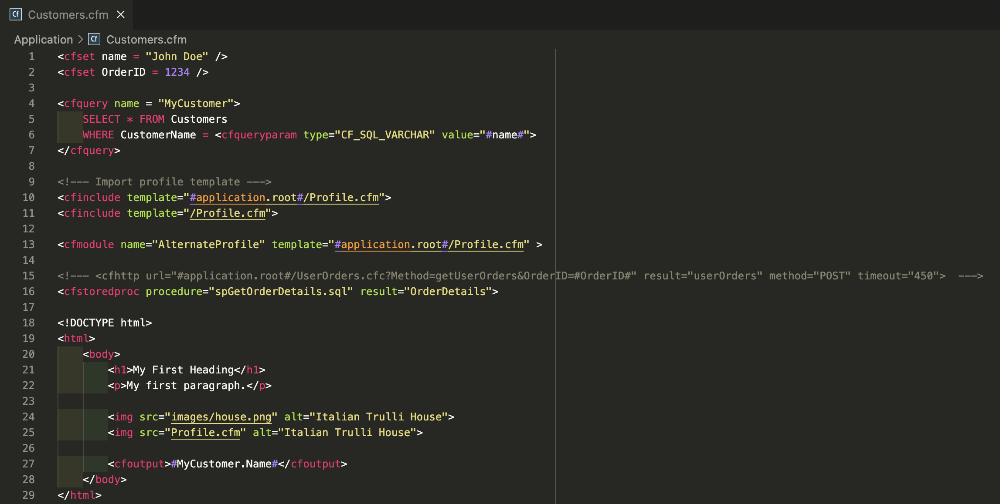

An extension to quickly jump to files in ColdFusion.

---

## Current Functionality

- `<cfinclude>`
  - Click the path in the `template="MyPage.cfm"` argument to jump to the listed `CF_PROJ_PATH/.../<MyPage>.cfm` file
- `<cfmodule>`
  - Click the path in the `template="MyPage.cfm"` argument to jump to the listed `CF_PROJ_PATH/.../<MyPage>.cfm` file
- `<cfstoredproc>`
  - Click the path in the `procedure="spMyProcedure"` / `procedure="dbo.spMyProcedure"` argument to jump to the listed sql file (in `DB_PROJ_PATH/dbo/Stored Procedures/spMyProcedure` / `DB_PROJ_PATH/dbo/Stored Procedures/spMyProcedure`)
- `<cfquery>` tag
  - Click the table name in the `FROM TableName` argument to jump to the `TableName.sql` sql file

### Stretch Goals

- `<cfquery>` tag
  - Click table names in the `JOIN TableName` argument to jump to the `TableName.sql` sql file
- `cfquery` variable name
  - Click the variable name (`<cfquery name="MyQueryName">`) of a the `cfquery` search defined previously in the current file to jump to the definition

## Plugin Settings

- (`fileroots`) Root paths for the projects in this workspace folder. Add the root paths to your CF project and SQL DB project in here
- (`linkRawFilenames`) Show links on raw filenames in code (those without relative or absolute path). Turn off to increase load speed and performance.
- (`exclude`) Which links to exclude (regexs, a match is enough)"
- (`fileroots`) Root directories for the sites in this workspace folder"
- (`removePathFromLabel`) Remove the file path from the label. Path shown twice if lineNr's or absolute paths.
- (`alwaysShow`) Always show \"CF-Click Links\" view
- (`showIfCFML`) Show \"CF-Click Related Links\" view when file language is CFML
- (`enableLogging`) Show a few log statements when clicked on a row or opening a file. Used for debugging.

## Known Bugs

- Bugs in cfquery table name linking:
  - Currently only works for the first table in query (the one straight after the FROM operator)

If you encounter any bugs, please [submit an issue](https://github.com/Anwealso/cf-click/issues/new/choose).

---

Made with ❤️

